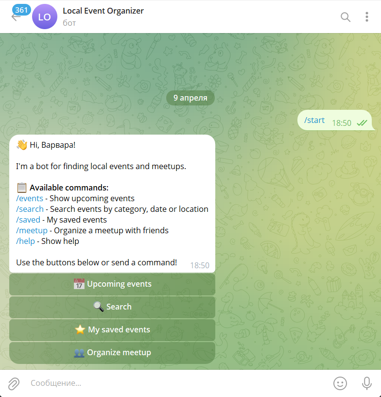
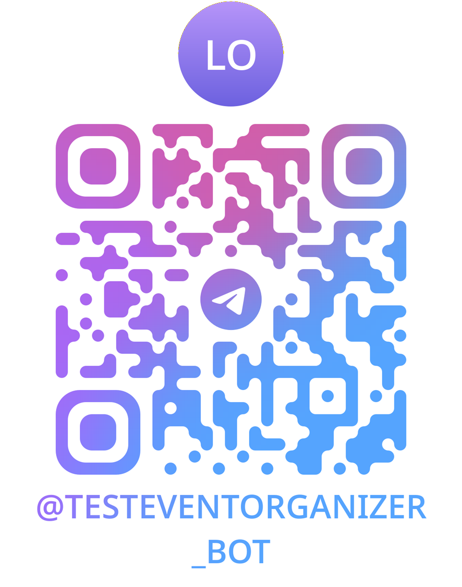

# Local Event Organizer 🎯

Telegram bot for finding local events and organizing meetups with friends.



---

## 📋 Product Context

### End Users
- Residents or visitors in cities looking for local events or meetups
- People who want to quickly organize meetups with friends
- Users who prefer Telegram as their primary communication platform

### Problem Solved
It's difficult for people to find interesting local events or quickly organize meetups with friends. Existing solutions are often scattered across multiple platforms and require manual searching.

### Our Solution
A Telegram bot that uses an LLM to parse user queries and suggest relevant events from a curated PostgreSQL database. The bot also helps users organize simple meetups by suggesting times, locations, and creating reminders.

---

## ✨ Features

### Implemented (Version 1)
- ✅ Search events by category (concert, theater, sport, IT, business)
- ✅ Search events by date (YYYY-MM-DD format)
- ✅ Search events by location (city or venue name)
- ✅ View upcoming events
- ✅ Save favorite events for later
- ✅ List saved events
- ✅ Remove events from saved list
- ✅ Interactive inline keyboard navigation
- ✅ PostgreSQL database with event storage
- ✅ Docker support for easy deployment

### Implemented (Version 2)
- ✅ Meetup organization (create and join meetups)
- ✅ Meetup participant management
- ✅ Polished UI with better event formatting
- ✅ Docker Compose for all services
- ✅ Comprehensive documentation

### Not Yet Implemented (Future Enhancements)
- ⏳ LLM-powered natural language query parsing
- ⏳ Push notifications/reminders for upcoming events
- ⏳ Event recommendations based on user preferences
- ⏳ Integration with external event APIs
- ⏳ Web dashboard for event organizers
- ⏳ Multi-language support
- ⏳ Location-based event suggestions using geolocation

---

## 🚀 Usage

### Prerequisites
- Python 3.12+
- PostgreSQL 16+
- A Telegram Bot Token (get from [@BotFather](https://t.me/BotFather))

### Quick Start

1. **Clone the repository**
   ```bash
   git clone <your-repo-url>
   cd se-toolkit-hackathon
   ```

2. **Set up environment variables**
   ```bash
   cp .env.example .env
   ```
   Edit `.env` and add your `BOT_TOKEN` from BotFather.

3. **Install dependencies**
   ```bash
   pip install -r requirements.txt
   ```

4. **Start PostgreSQL** (if not using Docker)
   ```bash
   # Create database
   createdb -U postgres events_db
   ```

5. **Initialize database and seed data**
   ```bash
   python seed.py
   ```

6. **Run the bot**
   ```bash
   python main.py
   ```

### Using Docker (Recommended)

1. **Set up environment variables**
   ```bash
   cp .env.example .env
   # Edit .env with your BOT_TOKEN
   ```

2. **Start all services**
   ```bash
   docker-compose up -d
   ```

3. **Seed the database**
   ```bash
   docker-compose exec bot python seed.py
   ```

4. **View logs**
   ```bash
   docker-compose logs -f bot
   ```

### Bot Commands

Once the bot is running, open Telegram and start a chat with your bot:

- `/start` - Initialize the bot and see the main menu
- `/events` - Show upcoming events
- `/search` - Search events by category, date, or location
- `/saved` - View your saved events
- `/meetup` - Create or find meetups
- `/help` - Show help message

### Search Examples

```
category:concert        # Search by category
date:2024-05-15         # Search by date
location:Innopolis      # Search by location
```

---

## 🏗️ Architecture

### Tech Stack
- **Backend**: Python 3.12, python-telegram-bot (async)
- **Database**: PostgreSQL 16 with SQLAlchemy ORM
- **Deployment**: Docker & Docker Compose
- **Architecture**: Layered (Bot → Repositories → Database)

### Project Structure

```
se-toolkit-hackathon/
├── bot.py                  # Telegram bot handlers
├── config.py               # Application settings
├── database.py             # Database connection
├── models.py               # SQLAlchemy models
├── repositories.py         # Database CRUD operations
├── main.py                 # Entry point
├── seed.py                 # Database seeding script
├── requirements.txt        # Python dependencies
├── Dockerfile              # Backend container
├── docker-compose.yml      # Multi-service orchestration
└── .env.example            # Environment variables template
```

### Database Schema

- **events** - Local events with title, description, category, location, time
- **users** - Telegram bot users
- **saved_events** - User's favorite events (many-to-many)
- **meetups** - User-organized meetups
- **meetup_participants** - Meetup participants (many-to-many)

---

## 🛠️ Development

### Running Tests
```bash
python -m pytest tests/ -v
```

### Code Style
```bash
# Install linters
pip install black flake8

# Format code
black .

# Check style
flake8 .
```

### Database Migrations
```bash
# Initialize alembic (if needed)
alembic init alembic

# Create migration
alembic revision --autogenerate -m "description"

# Apply migrations
alembic upgrade head
```

---

## 🚢 Deployment

### OS Requirements
- Ubuntu 24.04 (or any modern Linux distribution)
- Windows/macOS for development

### What Should Be Installed

For manual deployment:
- Python 3.12+
- PostgreSQL 16+
- pip and virtualenv

For Docker deployment:
- Docker 24+
- Docker Compose 2.20+

### Step-by-Step Deployment (Docker)

1. **Install Docker and Docker Compose**
   ```bash
   # Ubuntu
   sudo apt update
   sudo apt install docker.io docker-compose-plugin
   sudo systemctl enable docker
   ```

2. **Clone the repository**
   ```bash
   git clone <your-repo-url>
   cd se-toolkit-hackathon
   ```

3. **Configure environment**
   ```bash
   cp .env.example .env
   nano .env  # Add your BOT_TOKEN and other settings
   ```

4. **Get a Telegram Bot Token**
   - Open Telegram and search for `@BotFather`
   - Send `/newbot` and follow instructions
   - Copy the token to `.env`

5. **Start services**
   ```bash
   docker-compose up -d
   ```

6. **Verify services are running**
   ```bash
   docker-compose ps
   docker-compose logs -f bot
   ```

7. **Seed the database**
   ```bash
   docker-compose exec bot python seed.py
   ```

8. **Test the bot**
   - Open Telegram
   - Find your bot by username
   - Send `/start`

### Step-by-Step Deployment (Manual)

1. **Install PostgreSQL**
   ```bash
   sudo apt install postgresql postgresql-contrib
   sudo systemctl enable postgresql
   ```

2. **Create database**
   ```bash
   sudo -u postgres createdb events_db
   sudo -u postgres psql -c "ALTER USER postgres PASSWORD 'postgres';"
   ```

3. **Set up Python environment**
   ```bash
   python3.12 -m venv venv
   source venv/bin/activate
   pip install -r requirements.txt
   ```

4. **Configure and seed**
   ```bash
   cp .env.example .env
   # Edit .env with your settings
   python seed.py
   ```

5. **Run the bot**
   ```bash
   python main.py
   ```

### Accessing PgAdmin (Optional)

If you started with the tools profile:
```bash
docker-compose --profile tools up -d
```

Open browser: http://localhost:5050
- Email: admin@admin.com
- Password: admin

---

## 📝 Development Plan

### Version 1 (Core Feature)
- [x] Basic Telegram bot with command handlers
- [x] PostgreSQL database integration
- [x] Search events by category, date, location
- [x] Save and list favorite events
- [x] Interactive inline keyboards
- [x] Docker support

### Version 2 (Enhanced Features)
- [x] Meetup creation and management
- [x] Meetup participant tracking
- [x] Improved UI and event formatting
- [x] Docker Compose for all services
- [x] Comprehensive documentation
- [x] Deployment guide

---

## 📄 License

MIT License - see [LICENSE](LICENSE) file for details.

---

## 👥 Team

- **Developer**: Varvara Dorokhina
- **University**: Innopolis University
- **Email**: v.dorokhina@innopolis.university
- **Group**: B25-DSAI-04

---

## 🔗 Links

- **GitHub Repository:** https://github.com/Dorohina/se-toolkit-hackathon
- **Try the Bot:** https://t.me/testeventorganizer_bot
- [Telegram Bot API](https://core.telegram.org/bots/api)
- [python-telegram-bot Documentation](https://docs.python-telegram-bot.org/)

### QR Codes

**GitHub Repository:**


**Telegram Bot:**

